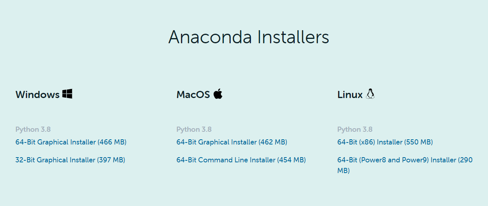
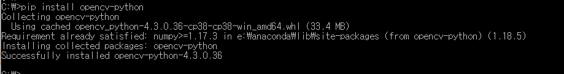
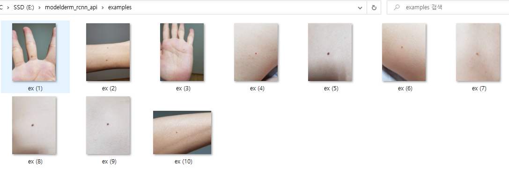
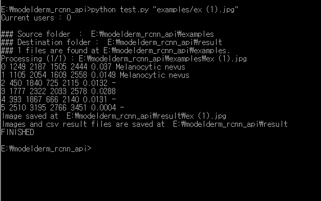
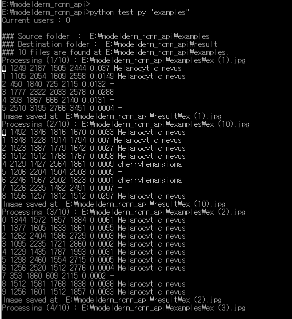
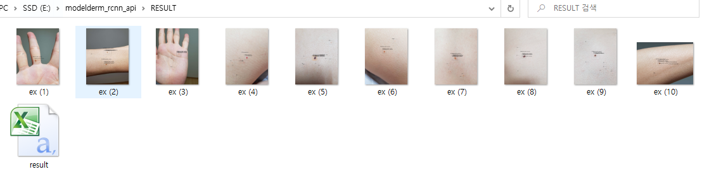

JAMA Dermatology (doi @) 와 PLOS Medicine (doi @) 에 publish 되었던 region-based CNN 모델의 online API 입니다. 모델 API 는  are provided without restriction. 전송된 사진은 IP 정보와 함께 저장되며 algorithm 의 정확도 개선을 위한 목적으로만 사용됩니다.

# Requirement
1) Download and install python 3 (ex. 64 bit python 3.8) at https://www.anaconda.com/products/individual#Downloads

2) Install opencv
	(windows) pip install opencv-python
	(linux) sudo pip install opencv-python
	

# How to Use 

/examples 폴더에 10개의 예제 사진이 있습니다.

한개의 사진만으로 결과를 얻고 싶다면 아래와 같이 실행합니다.

	python test.py [test_jpg file] [save_folder; default=result]

폴더 전체의 사진으로 결과를 얻고 싶다면 아래와 같이 실행합니다.

	python test.py [test_folder] [save_folder; default=result]

결과물은 /result 폴더에 있습니다.

결과는 .csv 포맷으로도 저장되며 아래와 같습니다.

https://github.com/whria78/modelderm_rcnn_api/blob/master/RESULT/result.csv

# Waiting Policy
현재 test server 는 1장을 분석하는데 10,30초정도 소요되며, 대략 1주일에 2만,3만장을 분석할 수 있는 capacity 를 가지고 있습니다. IP 기준으로 동시 사용자가 3명을 초과하는 경우 누적 사용량이 많은 user 가 wait 하는 방식으로 운영되고 있습니다.

# Contact Information
다량의 사진 분석이 필요한 경우나, IRB issue 로 사진이 저장되기를 원하지 않는 경우 Han Seung Seog (whria78@gmail.com) 에 contact 하세요. 

# Citation
1) JAMA Dermatology - model development and validation study
2) PLOS Medicine - retrospective cohort study