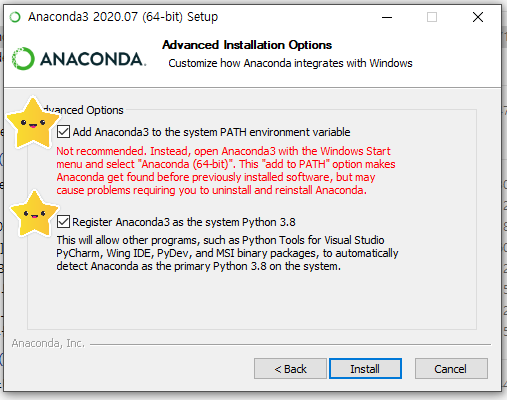
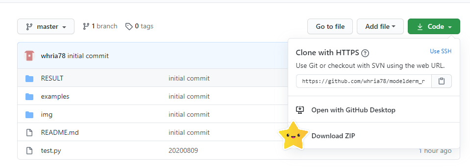
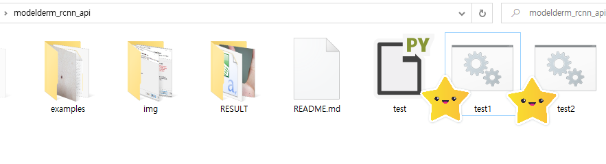

JAMA Dermatology (http://doi.org/10.1001/jamadermatol.2019.3807) 와 PLOS Medicine (doi @) 에 publish 되었던 region-based CNN 모델의 online API 입니다. 모델 API 는  are provided without restriction. **전송된 사진은 IP 정보와 함께 저장되며 algorithm 의 정확도 개선을 위한 목적으로만 사용됩니다. The submitted images are transferred with IP address and stored as a database, which will be used only for the training of the algorithm. **

# Requirement
1) Download and install python 3 (ex. anaconda version 3.8 64 bit) at https://www.anaconda.com/products/individual#Downloads

	

	

	Please be sure to add the system PATH. 
	
	

2) Install opencv

	<pre><code>
	(windows) pip install opencv-python
	
	(linux) sudo pip install opencv-python
	</code></pre>
	
	
	

3) Download api files from github and extract files.

	

# How to Use 

1) /examples 폴더에 10개의 예제 사진이 있습니다. (CC-BY-NC license)

	

2) 한개의 사진만으로 결과를 얻고 싶다면 아래와 같이 실행합니다.

	<pre><code>
	python test.py [test_jpg file] [save_folder; default=result]
	</code></pre>

	
	

	또는 test1.bat 를 실행해도 됩니다.
	
	

3) 폴더 전체의 사진으로 결과를 얻고 싶다면 아래와 같이 실행합니다.

	<pre><code>
	python test.py [test_folder] [save_folder; default=result]
	</code></pre>
	
	
	

	또는 test2.bat 를 실행해도 됩니다.

	

4) 결과물은 /result 폴더에 있습니다.

	
	

5) 결과는 .csv 포맷으로도 저장되며 아래와 같습니다. x0,y0,x1,y1,malignancy output,prediction 의 순서로 저장됩니다. prediction 에서 "-" 는 nonspecific lesion 을 나타냅니다.

	
	https://github.com/whria78/modelderm_rcnn_api/blob/master/RESULT/result.csv

# Waiting Policy
현재 test server (GPU = 2080x1, 1070x1) 는 1장을 분석하는데 10,30초정도 소요되며, 대략 1주일에 2만,3만장을 분석할 수 있는 capacity 를 가지고 있습니다. 동시 사용자가 3명을 초과하는 경우 누적 사용량이 많은 user 가 wait 하는 방식으로 운영되고 있습니다. 개별 사용자의 구별은 IP address 로 하고 있습니다.

# Contact Information
IRB issue 로 사진이 저장되기를 원하지 않는 경우 Han Seung Seog (whria78@gmail.com) 에 contact 하세요. 

# Citation
1) JAMA Dermatology - model development and validation study

<pre><code>
@article{10.1001/jamadermatol.2019.3807,
    author = {Han, Seung Seog and Moon, Ik Jun and Lim, Woohyung and Suh, In Suck and Lee, Sam Yong and Na, Jung-Im and Kim, Seong Hwan and Chang, Sung Eun},
    title = "{Keratinocytic Skin Cancer Detection on the Face Using Region-Based Convolutional Neural Network}",
    journal = {JAMA Dermatology},
    year = {2020},
}
</pre></code>

2) PLOS Medicine - retrospective cohort study

<pre><code>

</pre></code>